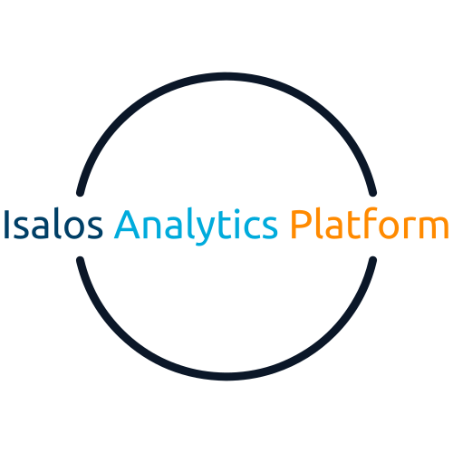

  <h1>Introduction</h1>
  

 
The Isalos Predictive Analytics Platform (Isalos) is a simple, user-friendly software designed to facilitate data manipulation and model development without requiring programming  skills. This platform empowers non-programmers to engage in data analytics through an intuitive interface, which leverages commonly used computer functions such as menus, buttons, and spreadsheets. Isalos is designed to streamline the development of predictive models by allowing users to manipulate and process data in an accessible, visual format. The platform’s primary goal is to enable data analysis without needing to write code, making it highly accessible to business professionals, analysts, or anyone with basic computer skills.
 

[Click here for your 3-month free trial!](https://enaloscloud.novamechanics.com/novamechanicssystem/userregistration/){: .btn .btn-green }

## Core Concept
The core operation of Isalos revolves around the concept of tabs, which act as nodes where data are imported, processed, and transformed. Each tab serves as an independent function node, taking input data, processing it, and outputting the results, which can be further processed in subsequent tabs. Each tab contains an input spreadsheet for loading data, a function area for processing, and an output spreadsheet where the results of the operation are displayed.

<!--## Table of contents
{: .no_toc .text-delta }

1. TOC
{:toc}-->

---

<!--

-->

### What can you do with Isalos? Here are a few examples:
* Prepare your data for modelling, following standard pre-processing steps (normalization, filtering, variable selection, and data partitioning).
* Develop and validate your own models through an intuitive environment.
* Deploy and share your models via the [Enalos Cloud Platform](https://www.enaloscloud.novamechanics.com/).
* Devise your experimental plan based on the Isalos Experimental Design functionalities.
* More coming soon…
 
## About Us
NovaMechanics (NovaM) is an SME based in Cyprus with over 10 years of experience in R&D projects. The company focuses on developing scientific solutions and software tools in the fields of chem/bio/nano informatics, simulation, and medicinal & materials chemistry. The company applies state-of-the-art mathematical techniques to create, implement, and interpret validated predictive models for big data analysis, computer-aided drug discovery, materials science, and computational fluid dynamics (CFD). NovaM's goal is to increase profitability, reduce risk, and decrease experimental costs in the process of designing and producing new materials or drugs.

NovaM has a range of proprietary software and computing infrastructure including multiple informatics tools and services for Design of Experiments, Image Analysis (using Deep Learning and AI), APIs, Dockers solutions, Omics analysis, Quantum Mechanics and Molecular Dynamics Simulations, Exposure and Biokinetics modelling, and Databases ([nanoPharos](https://pharos.novamechanics.com/nanopharos.html) & [chemPharos](https://pharos.novamechanics.com/chempharos.html)). NovaM's software solutions come in the form of cloud-based solutions like [Enalos Cloud Platform](https://www.enaloscloud.novamechanics.com/), and standalone software solutions like [Isalos Analytics Platform](https://isalos.novamechanics.com/).