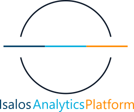

<!--

-->
# Introduction
{: .no_toc }
 
Isalos Predictive Analytics Platform (in short Isalos) is a simple and user-friendly software application that allows data manipulation and model development by non-programmers, as coding skills are not necessary to use the platform.  
 

 ----
 
