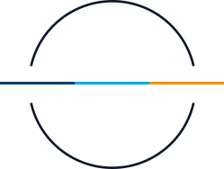
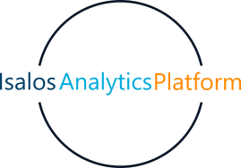

# Introduction
{: .no_toc }
Isalos Predictive Analytics Platform (in short Isalos) is a simple and user-friendly software application that allows data manipulation and model development by non-programmers, as coding skills are not necessary to use the platform.  

 ----
 
